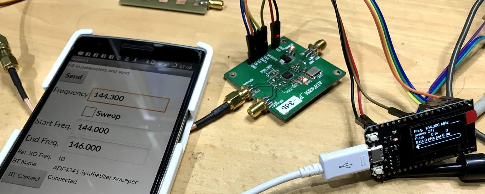
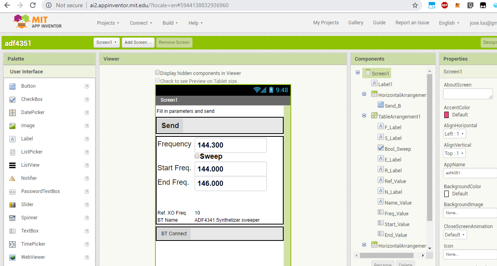

# Another ADF4351 controller

This project allows remote configuration of an ADF4351 eval board from a smartphone.

Smartphone talks bluetooth to an ESP32 module which in turn talks SPI to the module.

The module stores its configuration to the eeprom and reloads the latest configuration
upon startup so the smartphone is only needed to change the configuration.

The module used is a 16 Mt Bytes (128 Mt bit) Pro ESP32 OLED V2.0 TTGO 
https://www.banggood.com/16-Mt-Bytes-128-Mt-bit-Pro-ESP32-OLED-V2_0-TTGO-For-Arduino-ESP32-OLED-WiFi-ModulesBluetooth-p-1205876.html?cur_warehouse=CN

It is programmed using the arduino IDE after having done the proper setup:

- https://github.com/espressif/arduino-esp32
- https://esp-idf.readthedocs.io/en/latest/get-started/index.html

The smartphone is programmed using the MIT appinventor system, create an account here: http://ai2.appinventor.mit.edu
then import the file adf4351.aia

Programming with appinventor:
The interface composer screen:

The programming screen:

Comments and pull requests welcomed
